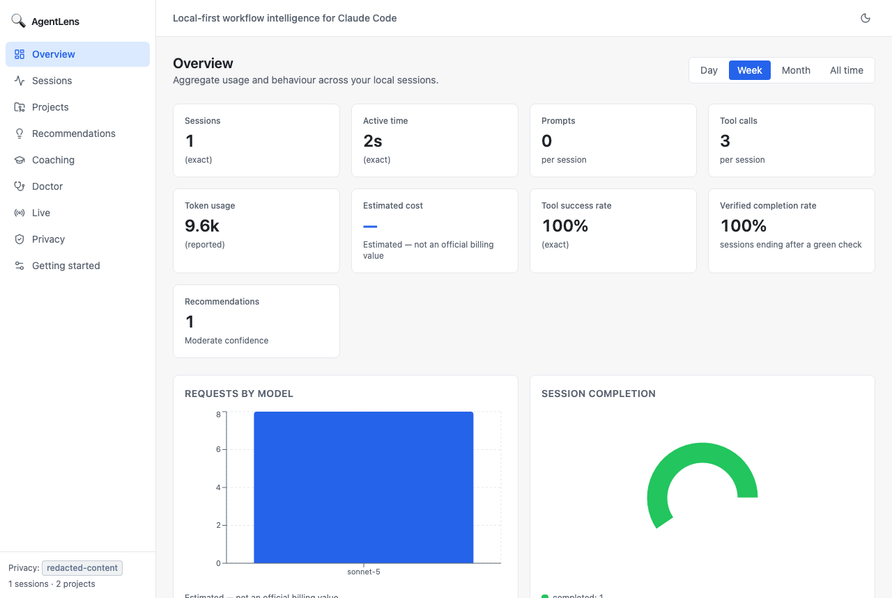
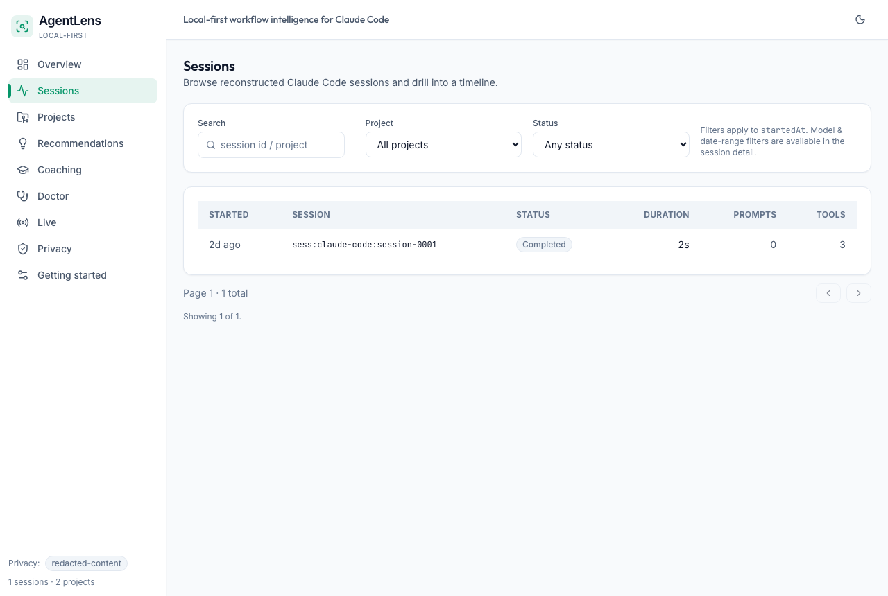
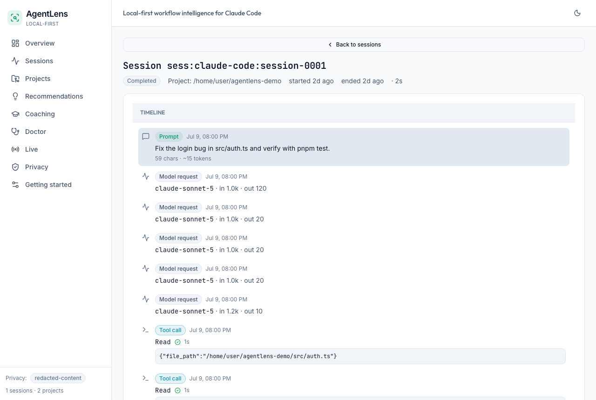
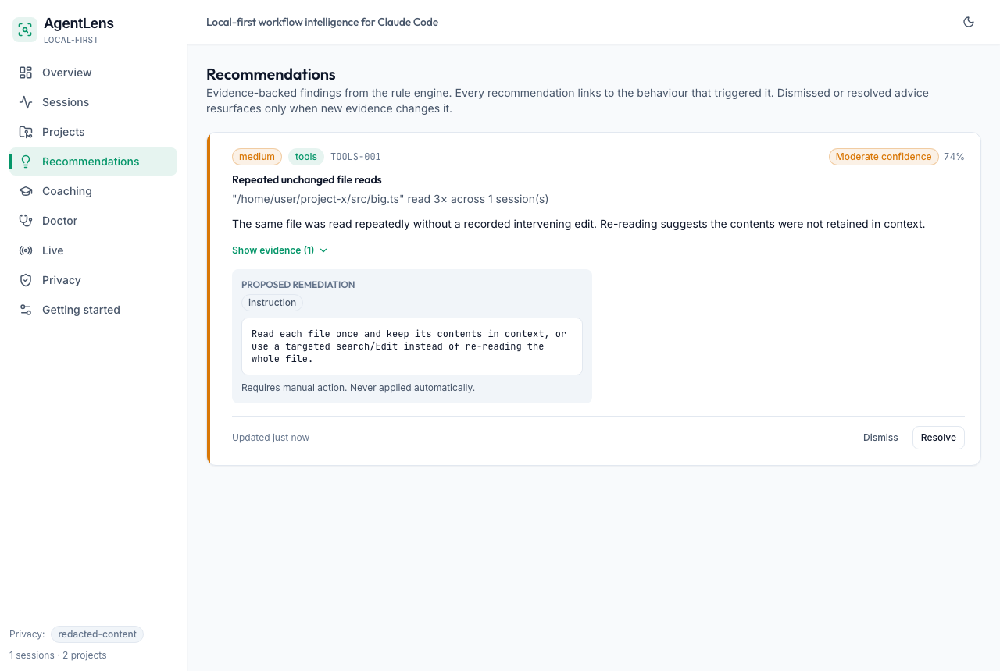
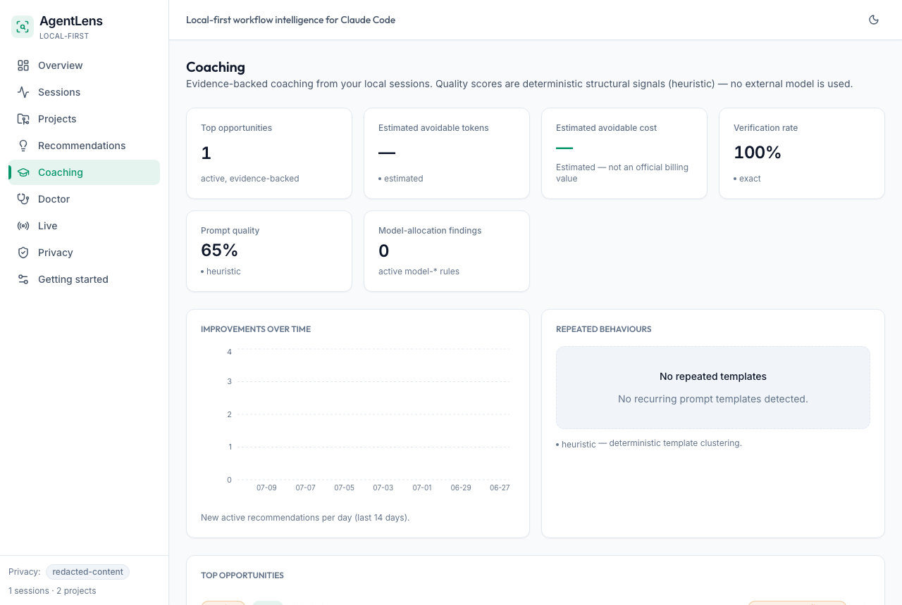
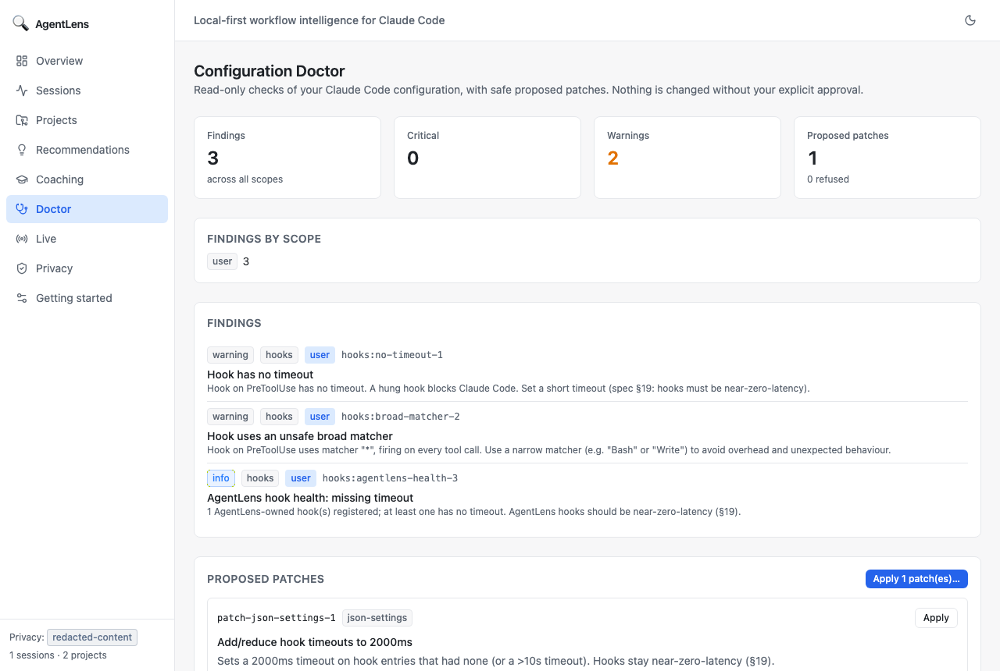

# AgentLens

> Local-first, privacy-first analytics and coaching for AI coding agents.

AgentLens reads transcripts, hooks, and OpenTelemetry telemetry from **your own
machine**, reconstructs sessions, computes metrics, and produces
**evidence-backed recommendations** — not generic advice. It also includes a
Configuration Doctor that can _propose_ patches to your coding-agent settings,
but never applies anything without your explicit approval. **Claude Code is the
first supported source**; the provider-neutral `SourceAdapter` interface lets
other agents be added without touching the dashboard or analysis engine.

Everything runs locally. There is no account, no cloud database, no hosted
backend, no authentication, no AgentLens telemetry, and no transmission of your
transcripts anywhere by default. The local API binds to `127.0.0.1` only.

---

## What it gives you

- **Read-only analytics.** Discover sessions, parse transcripts incrementally,
  reconstruct timelines, and compute metrics with zero hooks or telemetry
  configured.
- **Evidence-backed recommendations.** 34 deterministic rules (e.g. "file read 6
  times with no intervening edit") with structured, queryable evidence — every
  recommendation links to the behaviour that triggered it.
- **Live observation.** An observation-only Claude Code plugin + hooks, a spool
  fallback, a local OTLP receiver, and an SSE-driven live dashboard. (More
  adapter plugins can follow the same pattern.)
- **Coaching.** A deterministic Prompt Coach (no external model by default),
  personal/project baselines, and a configurable model catalogue expressed only
  in relative capability/cost tiers.
- **Configuration Doctor.** Detects risky coding-agent config (broad permissions,
  no-timeout hooks, stale MCP servers) and generates patches you review, back
  up, approve, and can roll back.

---

## Privacy summary

AgentLens requires an **explicit** scan or integration action — it never scans
silently and never uploads anything. Three privacy modes control what is
persisted:

| Mode                             | Persists                                                                                                | Recommended for                         |
| -------------------------------- | ------------------------------------------------------------------------------------------------------- | --------------------------------------- |
| **metadata-only**                | ids, timestamps, tool names, durations, token/cost estimates, file-path hashes, command classifications | Maximal privacy; no prompt/command text |
| **redacted-content** _(default)_ | redacted prompts + commands, redacted relative paths, sanitised tool metadata, derived prompt features  | Most users                              |
| **full-local**                   | additional local content, **only** after a strong warning + explicit opt-in                             | Power users who want full local history |

Even in full-local mode, secret detection always runs. **Never** persisted: full
source-file contents, raw environment variables, authentication headers, API
keys, or known secret formats. Redaction runs **before** persistence **and**
before logging. Paths under your real home directory are anonymised by default.

You can purge everything with `agentlens privacy purge`, prune by retention with
`agentlens privacy retain`, or export a redacted bundle with
`agentlens privacy export`. See [`docs/privacy.md`](docs/privacy.md).

---

## Installation

Requirements: **Node.js ≥ 24** and **pnpm** (the repo pins `pnpm@10.33.0`).

```bash
pnpm install
pnpm build
```

The `agentlens` CLI is built to `apps/cli/dist/index.js`. Link it globally:

```bash
pnpm --filter @agentlens/cli build
npm link apps/cli   # makes `agentlens` available on your PATH
# or run it directly:
node apps/cli/dist/index.js --help
```

---

## Quick start

```bash
agentlens init                        # choose a privacy mode, create config + DB
agentlens scan                        # import coding-agent sessions locally
agentlens report --period week        # terminal analytics report
agentlens dashboard                   # open the local dashboard in a browser
```

Useful follow-ups:

```bash
agentlens status                       # counts + privacy mode + paths
agentlens rules list                   # browse the 34 recommendation rules
agentlens doctor --dry-run             # preview coding-agent config findings
agentlens integrate claude-code --status   # check the optional plugin
agentlens telemetry status             # check the optional OTLP receiver
agentlens privacy status               # what's stored + retention
```

Every command supports `--help` and `--json` where automation makes sense. The
CLI honours `NO_COLOR` and non-interactive terminals.

---

## CLI examples

```bash
# Scan a specific path or project window (no silent scanning)
agentlens scan --path ./my-project
agentlens scan --project my-project --since 2026-06-01
agentlens scan --dry-run               # discover only, persist nothing
agentlens scan --force                 # re-import unchanged files

# Reports in three formats
agentlens report --period month --format terminal
agentlens report --period week  --format markdown --output report.md
agentlens report --session <id> --format json

# Rules
agentlens rules explain TOOLS-001      # trigger, threshold, evidence, remediation
agentlens rules disable VERIFY-004     # threshold-tune via config, not edits

# Doctor (safe remediation)
agentlens doctor --dry-run --json      # findings + proposed patches, writes nothing
agentlens doctor --fix                 # interactive: show diff → approve → back up → apply
agentlens doctor --fix --yes --project my-project   # pre-approve for a single project

# Privacy
agentlens privacy paths                # print resolved data-home locations
agentlens privacy export               # write a redacted bundle to exports/
agentlens privacy purge                # delete ALL imported data (irreversible)
agentlens privacy retain --days 30      # prune sessions older than 30 days
```

Cost figures are always labelled **“Estimated — not an official billing value.”**
Metrics distinguish exact / reported / inferred / estimated / heuristic / unknown
provenance.

---

## Supported platforms

- **macOS** — data home: `~/Library/Application Support/AgentLens`
- **Linux** — `$XDG_DATA_HOME/agentlens` (or `~/.local/share/agentlens`)
- **Windows** — `%LOCALAPPDATA%\AgentLens`

`AGENTLENS_HOME` overrides the data home on every platform. `AGENTLENS_CLAUDE_HOME`
overrides the Claude Code config directory the Doctor inspects (useful for tests
and dry-runs that must not touch your real `~/.claude`). The variable name is
Claude-specific because that is the first adapter; future adapters will use
their own override paths.

---

## Dashboard

The dashboard is a local-only browser UI (no cloud account, no hosted backend)
driven by the loopback Fastify API. These screenshots were generated from
synthetic fixtures, so they contain **no real prompts, transcripts, or project
paths**.

### Overview



### Sessions



### Session detail



### Recommendations



### Coaching



### Configuration Doctor



---

## Known limitations

- Transcript/hook/telemetry fields are partially undocumented and version-dependent.
  Parsers are tolerant: a malformed line is recorded as a diagnostic and skipped,
  never failing an entire scan. Undocumented fields are treated as unstable.
- Token and cost figures are **estimates** derived from transcript-reported
  fields, never official billing data, and never a guarantee of savings.
- Only Claude Code is supported as a source in these phases, because the
  `claude-adapter` is the first `SourceAdapter` implementation. The domain model
  and `SourceAdapter` interface are provider-neutral so other coding agents can
  be added without changing the dashboard or analysis engine, but none ship yet.
- No cloud sync, accounts, team dashboards, or mobile apps (intentionally out of
  scope). See [§24 of the build prompt](agentlens-glm-5.2-build-prompt.md).
- Dashboard is the browser UI (no Tauri/Electron packaging in these phases).

---

## Development setup

Requirements: **Node.js ≥ 24** and **pnpm 10.33.0** (the repo pins it via
`packageManager`; `corepack enable` will pick it up).

```bash
pnpm install                 # install workspace deps
pnpm build                   # turbo build all packages
pnpm typecheck               # tsc --noEmit across the workspace
pnpm lint                    # eslint across the workspace
pnpm format:check            # prettier --check (or pnpm format to write)
pnpm test                    # unit tests (vitest)
pnpm test:integration        # integration tests
pnpm test:e2e                # Playwright E2E (dashboard); browsers pinned in-repo
```

### Per-package work

```bash
pnpm --filter @agentlens/analysis-engine build
pnpm --filter @agentlens/analysis-engine test
pnpm --filter @agentlens/analysis-engine lint
```

### Run a single test

The turbo `test` wrapper is `vitest run --passWithNoTests` and swallows extra
arguments. Bypass it with `exec`:

```bash
pnpm --filter @agentlens/analysis-engine exec vitest run src/rules/rules.test.ts
pnpm --filter @agentlens/analysis-engine exec vitest run -t "TOOLS-001"
pnpm --filter @agentlens/analysis-engine exec vitest run --watch src/rules/rules.test.ts
```

### Before a PR: the §26 gate

A change is not done until this sequence is green:

```bash
pnpm format:check && pnpm lint && pnpm typecheck && pnpm test && \
  pnpm test:integration && pnpm build && pnpm test:e2e
```

Then run the CLI smoke in an **isolated temp home** — never point it at your
real `~/.claude`:

```bash
HOME_TMP="$(mktemp -d)"
AGENTLENS_HOME="$HOME_TMP/al" node apps/cli/dist/index.js init
agentlens scan --path ./packages/test-fixtures/claude-code
agentlens report --period month
agentlens doctor --dry-run
```

See [`docs/architecture.md`](docs/architecture.md) for the package map and data
flow, [`docs/rules.md`](docs/rules.md) for the rule catalogue,
[`docs/troubleshooting.md`](docs/troubleshooting.md) for common issues, and
[`SECURITY.md`](SECURITY.md) for the threat model and reporting guidance.

## Contributing

We welcome contributions. Please read [`CONTRIBUTING.md`](CONTRIBUTING.md) for
setup, architecture boundaries, the "add a recommendation rule" recipe, commit
and changeset conventions, the hard privacy rules, and the PR checklist. The
authoritative specification is
[`agentlens-glm-5.2-build-prompt.md`](agentlens-glm-5.2-build-prompt.md). When the
spec and anything in this repo disagree, the spec wins.
