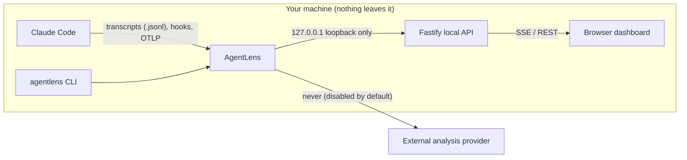
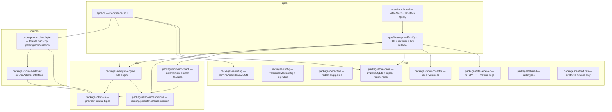
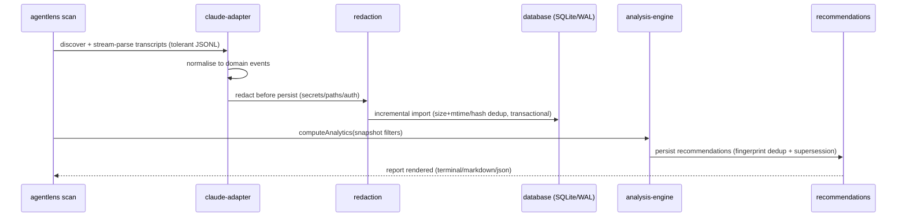
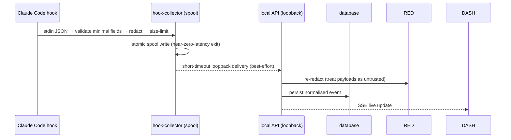
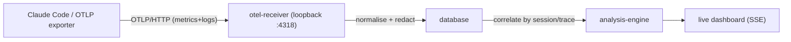
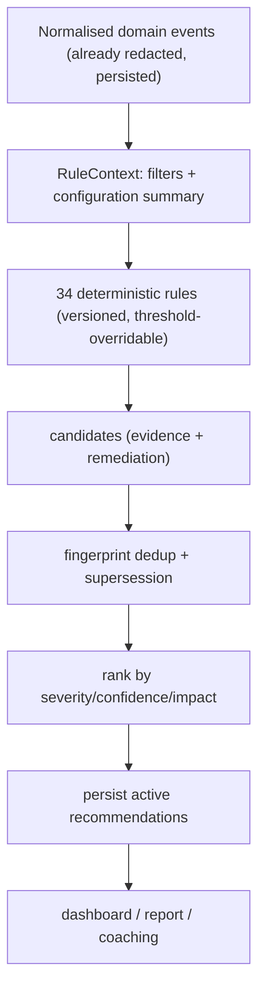
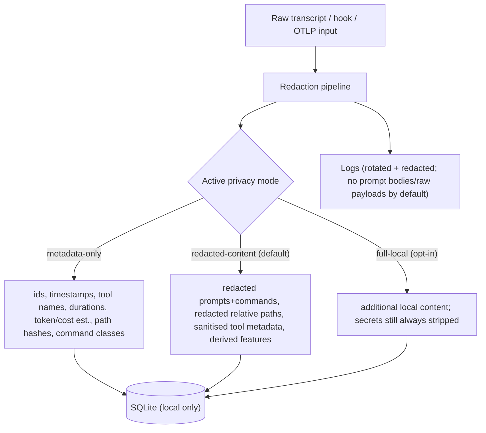

# Architecture

AgentLens is a local-first TypeScript monorepo: a CLI, a loopback Fastify API,
and a Vite/React dashboard, backed by a SQLite database and a provider-neutral
domain model. This document describes the system context, package boundaries,
and the three data flows (transcript import, hook capture, telemetry).

## System context

There is no account, cloud DB, hosted backend, auth, or AgentLens telemetry.
External analysis (an optional coaching provider) is **disabled by default** and
gated behind explicit opt-in, explicit provider+model, redaction before
transmission, preview, and a request timeout.

## Package boundaries

The key invariant: **`packages/domain` + `packages/source-adapter` define the
neutral contracts; `claude-adapter` is the only package that knows Claude’s
shapes.** The dashboard, analysis engine, and reporting depend only on
normalised domain events — never raw Claude transcript structures.

Boundary rules enforced by package dependencies and review:

- `domain` and `source-adapter` import nothing Claude-specific.
- `claude-adapter` is the **only** package that parses Claude transcript shapes.
- `analysis-engine`, `recommendations`, `prompt-coach`, `reporting`, and the
  dashboard consume normalised domain events only.
- `test-fixtures` contains **synthetic** transcripts only — no real transcript is
  ever committed, and no test depends on the developer’s real `~/.claude`.

## Data flow — transcript import

Highlights:

- **Incremental import** — a file is skipped when size + mtime match; re-imported
  (deleting the old rows first) when the parser version changes, the file is
  truncated, or the head hash differs; appended when the head is unchanged but
  the file grew. Re-runs are idempotent.
- **Redaction before persistence and before logging** (§3.2). Both a redacted
  representation and a stable hash are stored; the original is never stored
  alongside the redacted version.
- **Recommendations are persisted by `computeAnalytics`**, not by `scan`. A fresh
  database shows zero recommendations until an analytics pass runs (the dashboard
  runs one on load).

## Data flow — hook capture (Phase 2)

Hook processes must be **near-zero-latency**: read stdin → validate minimal
fields → redact → atomic spool or short-timeout loopback delivery → exit. The
DB, recommendations, and analysis are never run inside a hook process; Claude
Code is never blocked because AgentLens is unavailable. Hook payloads are
untrusted: validated, redacted, size-limited, never executed, and never passed
to a shell.

## Data flow — telemetry (Phase 2)

The OTLP receiver is local-only, disabled by default, and configurable via
`agentlens telemetry configure`. Telemetry log fields default to off (no prompt
bodies, no assistant responses, no raw API bodies).

## Recommendation engine

Every recommendation carries structured, queryable evidence (e.g. “file read 6
times with no intervening edit”). Confidence is a **deterministic function of
the evidence**, never a guess. Every metric carries a provenance tag (`exact`,
`reported`, `inferred`, `estimated`, `heuristic`, `unknown`). Remediations are
proposed only; `automaticallyApplicable` is always `false` (§3.5). Analysis is
incremental — rule versions + fingerprints are persisted so only affected rules
re-run.

## Privacy boundaries

The redaction pipeline covers API keys, bearer tokens, JWTs, private keys,
password assignments, connection strings, cookies, auth headers, cloud creds,
`.env` values, user-defined regex/labels, optional email redaction, home-dir
redaction, and repo-path anonymisation. Secret detection runs even in full-local
mode; no secrets, auth headers, or known API-key formats are ever persisted.

## External-analysis boundary

External analysis (§19.5) is an opt-in coaching-provider interface, **disabled
by default**. When enabled it requires: explicit opt-in, explicit provider+model,
redaction before transmission, a preview, clear disclosure, a request timeout,
no automatic retries containing sensitive data, and no remote provider keys in
logs. The deterministic Prompt Coach works **without** any external model and is
what the dashboard uses by default.
